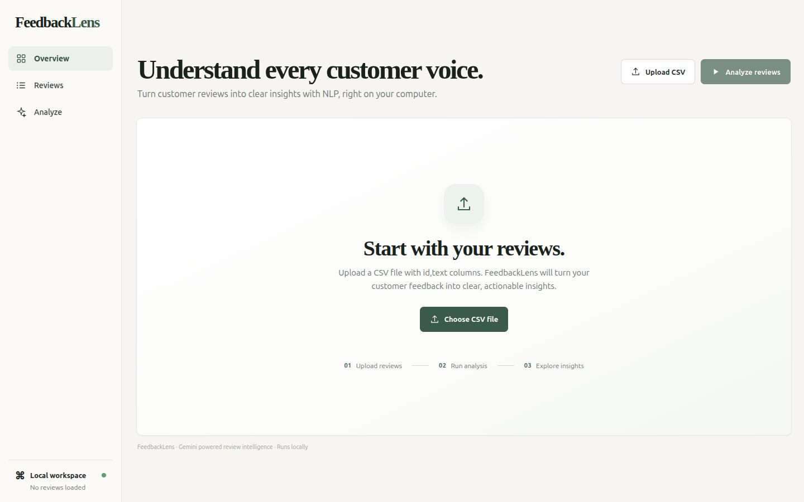

# FeedbackLens: Aspect-Based Customer Review Intelligence

> **Batch F — Capstone Project Submission**

---

## 👤 Student & Submission Details (Step 5)

| Field | Details |
| :--- | :--- |
| **Student Name** | Yash Kashyap |
| **Registration Number** | 23FE10CDS00337 |
| **Branch** | Computer Science & Engineering (Data Science) |
| **Batch** | Batch F |
| **Project Title** | FeedbackLens — Aspect-Based Customer Review Intelligence with Gemini LLM |
| **GitHub Username** | [imYashKASHYAP](https://github.com/imYashKASHYAP) |
| **Repository URL** | [https://github.com/imYashKASHYAP/MUJ-DS-23FE10CDS00337](https://github.com/imYashKASHYAP/MUJ-DS-23FE10CDS00337) |
| **Training Program** | Capstone Project & Data Science Training Program — Batch F |

---

## 📂 Repository Directory Structure (Step 4)

This repository strictly adheres to the **Batch F Capstone Guidelines**:

```
.
├── assignments/            # Step 4: Training program lab exercises & assignments tracking
│   └── README.md
├── notebooks/              # Step 4: Exploratory data analysis & NLP demonstration
│   └── 01_review_exploration_and_nlp.ipynb
├── code/                   # Step 4: Code directory index & module architecture
│   └── README.md
├── resources/              # Step 4: Datasets, schemas, and pre-computed sample results
│   ├── sample_reviews.csv
│   ├── schema_definition.json
│   └── sample_results/
│       ├── analysis.json
│       └── report.json
├── presentations/          # Step 4: Capstone presentation deck & slide materials
│   └── FeedbackLens_Presentation.md
├── capstone/               # Step 4: Capstone project summary and executive report
│   └── README.md
├── feedbacklens/           # Main Python package (Zero external dependencies)
│   ├── __init__.py
│   ├── __main__.py         # Command-line interface (analyze, report, web)
│   ├── core.py             # PII masking, LLM client, verification, cache, report
│   ├── web.py              # Lightweight local HTTP server
│   └── static/             # Vanilla HTML5 / CSS3 / ES6+ JavaScript dashboard
│       ├── index.html
│       ├── styles.css
│       └── app.js
├── examples/               # Sample inputs & dashboard preview screenshots
│   ├── dashboard-empty.jpg
│   └── sample_reviews.csv
├── prompts/                # System instruction prompts for Gemini
│   └── review_analysis.txt
├── tests/                  # Offline unit test suite (100% mocked, zero API cost)
│   └── test_core.py
├── config.json             # Model selection and operational configuration
├── run.py                  # Self-invoking Python launcher (auto-detects .venv)
├── .env.example            # Environment configuration template
└── README.md               # Main project documentation
```

---

## 📦 Project Deliverables Checklist (Step 11)

- [x] **Source Code:** Modular, production-ready implementation in [`feedbacklens/`](file:///c:/Users/yash_/Downloads/feedbacklens_submission/feedbacklens/feedbacklens/) and [`run.py`](file:///c:/Users/yash_/Downloads/feedbacklens_submission/feedbacklens/run.py) (Zero third-party dependencies).
- [x] **Documentation:** Comprehensive architecture explanation, schema definitions, and API specs.
- [x] **Presentation:** Complete 10-slide oral defense presentation in [`presentations/FeedbackLens_Presentation.md`](file:///c:/Users/yash_/Downloads/feedbacklens_submission/feedbacklens/presentations/FeedbackLens_Presentation.md).
- [x] **Jupyter Notebook:** Interactive pipeline walkthrough in [`notebooks/01_review_exploration_and_nlp.ipynb`](file:///c:/Users/yash_/Downloads/feedbacklens_submission/feedbacklens/notebooks/01_review_exploration_and_nlp.ipynb).
- [x] **Screenshots:** Dashboard preview in [`examples/dashboard-empty.jpg`](file:///c:/Users/yash_/Downloads/feedbacklens_submission/feedbacklens/examples/dashboard-empty.jpg).
- [x] **Results:** Pre-computed analysis and aggregate metrics in [`resources/sample_results/`](file:///c:/Users/yash_/Downloads/feedbacklens_submission/feedbacklens/resources/sample_results/).
- [x] **Installation Guide:** Detailed local execution instructions below.

---

## 🚀 Project Overview

**FeedbackLens** analyzes customer reviews using Google's **Gemini 3.1 Flash-Lite** large language model. For each customer review, the system produces:
1. **Overall Sentiment:** `positive`, `neutral`, `negative`, or `mixed`.
2. **Factual Summary:** Single-sentence recap under 25 words.
3. **Aspect-Level Sentiments:** Up to three categorized aspects (`product_quality`, `delivery`, `support`, `pricing`, `usability`, `other`) paired with **exact evidence quotes**.
4. **Urgency Priority:** `high` (safety/fraud/major loss), `medium`, or `low`.
5. **Recommended Business Action:** Grounded next step for customer success or product teams.
6. **Aggregate Trends:** Deterministic local counting of sentiments and aspect mentions across all reviews.



---

## 🛡️ Key Innovations & Technical Highlights

### 1. PII Redaction Before External Transmission
Before review text leaves the local machine, `core.redact_pii()` uses regex matching to mask email addresses and phone numbers as `[EMAIL]` and `[PHONE]`.

### 2. Strict JSON Schema & Anti-Hallucination Grounding
The Gemini API request enforces strict JSON schema adherence (`responseMimeType: "application/json"`). Upon receiving the output, Python executes `core.validate_result()`:
```python
if evidence.casefold() not in review_text.casefold():
    raise AnalysisError("Aspect evidence must quote the review exactly")
```
If the LLM fabricates an evidence quote that is not a verbatim substring of the customer review, the response is rejected.

### 3. SHA-256 Deduplication Caching
Every review is cached in `cache/<hash>.json` using a SHA-256 hash of `(redacted_review + prompt + model)`. Repeating an analysis makes zero external API calls.

### 4. Exponential Backoff & Fault Tolerance
Transient errors (HTTP 429 rate limits, 5xx server issues) automatically trigger exponential backoff retry cycles:
$$\text{sleep} = \text{retry\_base\_seconds} \times 2^{\text{attempt}}$$

---

## 💻 Installation & Quick Start Guide

### Requirements
- Python 3.10 or newer
- Standard internet connection (for live Gemini API calls)
- A Gemini API key (optional for UI exploration and offline unit testing)

### Step 1: Clone the Repository
```bash
git clone https://github.com/imYashKASHYAP/MUJ-DS-23FE10CDS00337.git
cd MUJ-DS-23FE10CDS00337
```

### Step 2: Configure Environment Variables
Copy `.env.example` to `.env` and insert your Gemini API key:
```bash
cp .env.example .env
```
Edit `.env`:
```env
GEMINI_API_KEY=your_actual_gemini_api_key_here
```

### Step 3: Run the Project
Launch the web dashboard with a single command:
```bash
python run.py
```
> The runner automatically detects `.venv` if present, loads `.env`, starts the local server at `http://127.0.0.1:8765`, and opens your default browser.

---

## 🖥️ Alternative Run Modes

### Running Batch Analysis via CLI
```bash
python run.py analyze --input resources/sample_reviews.csv --output results/analysis.json --report results/report.json
```

### Rebuilding Aggregate Report without API Calls
```bash
python run.py report --input results/analysis.json --output results/report.json
```

### Running the Offline Test Suite
Run the 7 automated unit tests (which execute with zero network calls and zero cost):
```bash
python run.py test
# Or natively:
python -m unittest discover -s tests -v
```

---

## 📊 Evaluation Criteria Alignment (30 Marks)

| Criteria | Max Marks | Implementation Highlights in FeedbackLens |
| :--- | :---: | :--- |
| **1. Project Implementation & Functionality** | **10** | End-to-end pipeline: PII masking, LLM generation, verbatim quote check, SHA-256 cache, full interactive web UI. |
| **2. Individual Contribution** | **8** | Structured multi-day commit history, modular package separation, automated unit tests, and comprehensive docs. |
| **3. Repository Organization & Documentation** | **4** | Clean directory layout (`assignments/`, `notebooks/`, `code/`, `resources/`, `presentations/`, `capstone/`), full README. |
| **4. Presentation & Demonstration** | **4** | Complete 10-slide presentation deck in [`presentations/`](presentations/) and working browser dashboard. |
| **5. Innovation & Problem Solving** | **4** | Zero external dependencies, verbatim evidence quote verification to eliminate hallucinations, local deterministic aggregation. |
| **Total** | **30** | **Full Academic Rubric Compliance** |

---

## 📄 License & Academic Integrity
This project is submitted as part of the **Batch F Capstone Project Submission**. All code is original and maintained by Yash Kashyap.
